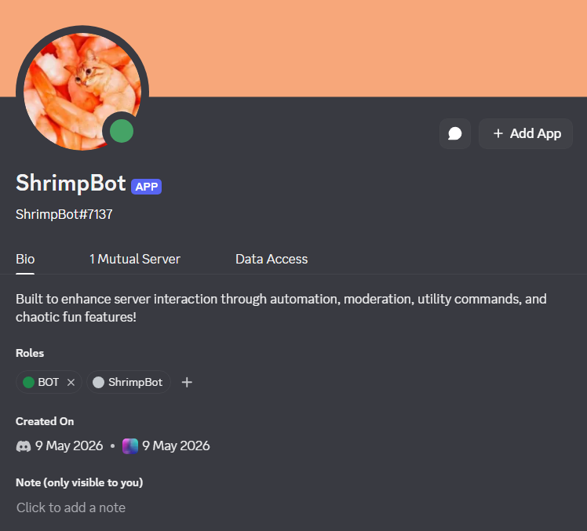

# 🤖 ShrimpBot

A fun and interactive Discord bot built for community engagement, moderation, entertainment, and utility features. ShrimpBot is designed to make servers more active with funny responses, useful commands, and customizable features.

---

## ✨ Features

* 🎮 Fun and meme commands
* 🛠️ Utility tools for server management
* 🔒 Moderation commands
* 📊 User interaction and engagement systems
* ☁️ Easy deployment and setup

---

## 📦 Tech Stack

* Node.js
* Discord.js
* JavaScript
* Sequelize & Keyv

---

## 🚀 Installation

### 1. Clone the repository

```bash
git clone https://github.com/Saptarshi-Bagchi/Discord-Bot
```

### 2. Create a `.env` file

```env
TOKEN=your_discord_bot_token
CLIENT_ID=your_client_id
GUILD_ID=your_server_id
```

### 3. Run the bot

```bash
node index.js
```

---

## 📸 Preview



---

## 🌐 Invite the Bot

```txt
https://discord.com/api/oauth2/authorize?... 
```

---

## 👤 Author

Made with caffeine and questionable coding decisions by **Saptarshi Bagchi**.
